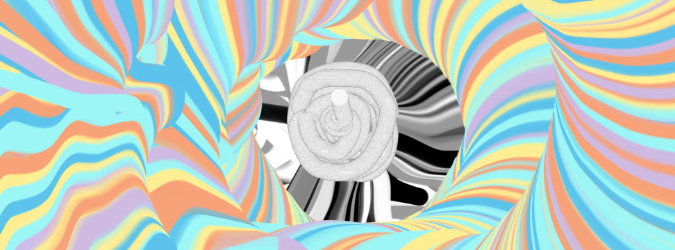

# Worm Interactive Art
A Interactive art made in JS with P5.js

**Only works with in a desktop enviroment, in mobile results may vary**

***
## Explanation
A simple art program made in JavaScript with the help of P5.js. The idea is simple, with the left mouse click you can spawn little balls that I called worms that follow your mouse cursor and leave a trail that paint a canvas.

***
## Commands
| Command       | Shortcut     | Explanation                                      |
| ------------- |:------------:|:------------------------------------------------:|
| Spawn Worm    | Left Mouse   | Spawn a worm with a random color from the palette|
| Pause         | Z            | Pause all the worms in the screen                |
| Clear         | C            | Clear the canvas and delete all the worms        |
| Delete Worms  | D            | Delete all the worms and don't clear the canvas  |
| Reverse       | X            | Make all the worms run away from your cursor     |
| Download Art  | None         | Download your art with alpha channel             |

***
## Some Arts made with Worm

Between Walls

The Hole

Rainbow Path
